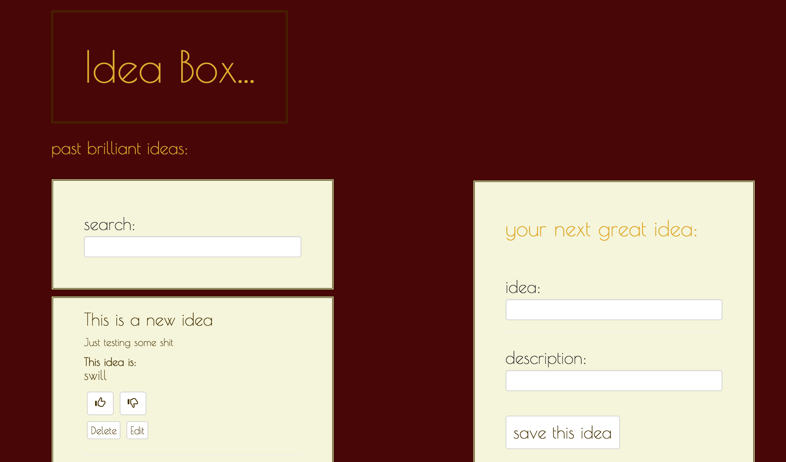

# Ideabox 2.0 Submission Form - Penney Garrett

# Basics

### Link to the Github Repository for the Project
[My Repo](https://github.com/PenneyGadget/idea_box)

### Link to the Deployed Application
[My Application](https://box-of-ideas.herokuapp.com/)

### Link to Your Commits in the Github Repository for the Project
[My Commits](https://github.com/PenneyGadget/idea_box/commits/master)

### Provide a Screenshot of your Application

## Completion

### Were you able to complete the base functionality?

Yes

### Which extensions, if any, did you complete?

I _really_ wanted to do an extension, but ran out of time :(

### Attach a .gif, or images of any extensions work being used on the site.

...

# Code Quality

### Link to a specific block of your code on Github that you are proud of

[Link](https://github.com/PenneyGadget/idea_box/blob/master/app/assets/javascripts/search_filter.js)

I am really proud of this function. It's concise and decently readable. But mostly I'm proud of it because I had to
work for it and I learned a lot in the process. I knew from jumping in the console and adding debuggers that the code worked - and yet... it didn't work. When I called the function in the console the code functioned perfectly and I was beating my head against a wall looking for typos, _anything_, as to why it didn't work in my app. I got some help from a mentor and ended up learning that, basically, because this function finishes faster than any of my AJAX calls, it didn't have any actual data to assign to the <code>$ideas</code> variable within it. So I added the function to the end of the function that grabs all the
ideas and BAM! It works :)

### Link to a specific block of your code on Github that you feel not great about

[Link](https://github.com/PenneyGadget/idea_box/blob/master/app/assets/javascripts/edit_idea.js)

This functions are really long and there's some repeated code. I tried to pull some of the logic out into separate functions,
but when I did that things would break. I'm pretty sure it was because of scoping issues, but I ran out of time to play
around with it more. At this point in the game there's obviously a LOT that I don't know about how to refactor javascript.
I really wish I'd had one more day on this project.

### Attach a screenshot or paste the output from your terminal of the result of your test-suite running.

I have one failing test and can't figure out why. This test wasn't failing initially and then last night all of a sudden it stopped working. The Capybara/Selenium is not filling in the search-filter box, so when I go to assert that certain information is no longer on the page, it is in fact still there. This feature works in production just fine and I'm targeting the text field the same way I am everywhere else in my app.

### Provide a link to an example, if you have one, of a test that covers an 'edge case' or 'unhappy path'

[User cannot create a new idea without both a title and body ](https://github.com/PenneyGadget/idea_box/blob/master/spec/models/idea_spec.rb#L16-L29)

----

## Instructor Input

148 - some wonkiness with the last selenium test that is failing. Be sure to not have failing tests on master in future projects but this one is reasonable. Great README! Great usage of selenium testing! Pretty interface.

### Data Model

(5 points total.)

### User Flows

#### Viewing ideas

(10 points total.)

#### Adding a new idea

(15 points total.)

#### Deleting an existing idea

(15 points total.)

#### Changing the quality of an idea

(15 points total.)

#### Editing an existing idea

(20 points total.)

#### Idea Filtering and Searching

(15 points total.)

## Instructor Evaluation Points

### Specification Adherence

* **10 points**: The application consists of one page with all of the major functionality being provided by jQuery. There is no use of `format.js` in Rails. There is no use of unobstrusive JavaScript. There are no front-end frameworks used in the application. No approach was taken that is counter to the spirit of the project and its learning goals. There are no features missing from above that make the application feel incomplete or hard to use.

### User Interface

* **5 points** - The application is pleasant, logical, and easy to use. There no holes in functionality and the application stands on it own to be used by the instructor _without_ guidance from the developer.

### Testing

* **10 points** - Project has a running test suite that exercises the application at multiple levels including JavaScript tests.

### Ruby and Rails Quality

* **10 points** - Developer is able to craft Rails features that make smart use of Ruby, follow the principles of MVC, and push business logic down where it belongs. There _zero_ instances where an instructor would recommend taking a different approach. Developer writes code that is exceptionally clear and well-factored. Application is expertly divided into logical components each with a clear, single responsibility.

### JavaScript Style

* **8 points** - Application is thoughtfully put together with some duplication and no major bugs. Developer can speak to choices made in the code and knows what every line of code is doing.

### Workflow

* **10 points** - The developer effectively uses Git branches and many small, atomic commits that document the evolution of their application.
