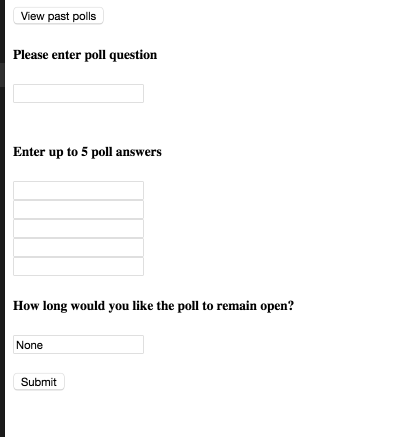

# RealTime Submission Form
[Project Spec](https://github.com/turingschool/curriculum/blob/master/source/projects/real_time.markdown)

------

# Basics

### Link to the Github Repository for the Project
[Your Repo](https://github.com/slota/real-time)

### Link to the Deployed Application
[Your Application](https://radiant-plateau-35828.herokuapp.com/)

### Link to Your Commits in the Github Repository for the Project
[Your Commits](https://github.com/slota/real-time/commits/master)

### Provide a Screenshot of your Application
)

## Completion

### Were you able to complete functionality that fits both case studies?
#### Yes

### Did you do anything outside the scope of the case studies?
#### Able to view history of past surveys

# Code Quality

### Link to a specific block of your code on Github that you are proud of

[proud-of-everything](https://github.com/slota/real-time/blob/master/server.js)

* Why were you proud of this piece of code?

###### There's really no piece I'm especially proud of, I was having a panic attack and cancelled all my plans to focus on this. I'm proud I got it done.

### Link to a specific block of your code on Github that you feel not great about

[sad](https://github.com/slota/real-time/blob/master/test/server-test.js)

* Why do you feel not awesome about the code? What challenges did you face trying to write/refactor it?

###### I didn't Test Drive, and that I feel isn't super cool. I also really don't have many tests at all :(

### Please feel free to ask any other questions or make any other statements below!

###### I really liked the websockets and express. Talking with some other Turing students, we wish that 4 focused more on mastering a specific skill rather than jumping around the place. Also it might behoove students to do Fecho instead of BoxTrot. I feel like I probably missed out on learning some high level javascript by doing BoxTrot. Although for work life balance that week was crucial. 

-----

## Instructor Feedback

161/200

### Concept and Features

Does it have the expected features?

* 100 points - Exceeded expectations. There are more features than we planned.

### Code Quality (JavaScript and/or Ruby)

* 20 points - Developer writes effective code, but does not breakout logical components. Application shows some effort to break logic into components, but the divisions are inconsistent or unclear. There are many large methods or functions and it is not clear to the evaluator what a given section of code does.

### Client-Side Application

* 25 points - Your application is thoughtfully put together with some duplication and no major bugs.

### Test-Driven Development

* 10 points - Many areas of the code are not covered by tests.

### Interface

* 2 points - The application shows effort in the interface, but the result is not effective. The evaluator has some difficulty using the application when reviewing the features in the user stories.

### Workflow

* 4 points - The developer makes a series of small, atomic commits that document the evolution of their application. There are no formatting issues in the code base.
